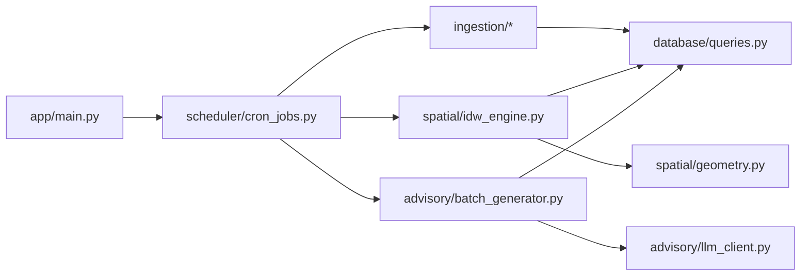

# Architecture Document - AI/Spatial Microservice

## Pipeline Architecture
Berikut adalah alur data dari sumber, pemrosesan, hingga penyimpanan untuk setiap siklus *cron*.

```mermaid
graph TD
    subgraph External APIs
        W[WAQI API]
        O[OpenAQ API]
        N[NASA FIRMS]
    end

    subgraph FastAPI Application
        C((Cron Scheduler))
        
        subgraph Ingestion Layer
            IA[Air Quality Fetcher]
            IF[Hotspot Fetcher]
        end
        
        subgraph Spatial Engine
            Geo[Geometry Utils]
            IDW[Hotspot-Adjusted IDW]
        end
        
        subgraph Advisory Module
            G[Grouper]
            LLM[LLM Client]
            FB[Fallback Engine]
        end
        
        DBClient[Database Driver]
    end

    subgraph PostgreSQL + PostGIS
        T1[(stasiun_ispu)]
        T2[(active_hotspots)]
        T3[(log_ispu_kelurahan)]
    end

    C -->|Trigger (tiap 3 jam)| IA
    C -->|Trigger (tiap 3 jam)| IF
    W --> IA
    O --> IA
    N --> IF
    IA --> Geo
    IF --> Geo
    Geo --> IDW
    IDW --> G
    G --> LLM
    LLM -.->|If Fails| FB
    LLM --> DBClient
    FB --> DBClient
    
    IA --> DBClient
    IF --> DBClient
    DBClient --> T1
    DBClient --> T2
    DBClient --> T3
```

## Module Dependency


## Data Flow (Aliran Data)
1. Penjadwal *APScheduler* men-trigger *Pipeline*.
2. Modul *Ingestion* memanggil API secara asynchronous menggunakan `httpx`.
3. Data titik stasiun di-upsert ke `stasiun_ispu`. Data titik panas menghapus data kelotongan terakhir di `active_hotspots` dan memasukkan data *fresh*.
4. Modul *Spatial Engine* me-load koordinat dari basis data, menghitung jarak geometri menggunakan *GeoPandas* / *Shapely*, dan menerapkan formula *Hotspot-Adjusted IDW*.
5. Hasil perhitungan (berupa DataFrame/List dari ID, nama kelurahan, dan nilai ISPU) diserahkan ke *Advisory Module*.
6. Modul ini mengelompokkan data berdasarkan rentang kategori ISPU (contoh: *Baik*, *Sedang*).
7. Untuk setiap grup unik, `llm_client.py` menembak *prompt* ke layanan LLM.
8. Teks *advisory* yang dihasilkan dipasangkan kembali ke setiap kelurahan dan ditulis secara massal (batch insert) ke tabel `log_ispu_kelurahan`.

## Desain Scheduler (APScheduler Integration)
FastAPI digunakan sebagai wadah servis yang stabil. *APScheduler* berjalan di latar belakang (*background thread* / *asyncio event loop*) dalam siklus kehidupan (*lifespan*) FastAPI. API endpoints disediakan untuk me-monitor *status jobs*, atau memicu eksekusi manual di luar siklus 3-jam untuk keperluan *debugging*.

## Strategi Error Handling & Retry
- **Eksternal API Request**: Dilakukan retri eksponensial (misal *library* `tenacity`) karena API sering *flaky* (contoh: batas beban *free tier*).
- **LLM Rate Limits**: Jika terjadi `HTTP 429 Too Many Requests`, *advisory generator* akan beralih langsung ke modul *fallback templates* untuk mencegah putusnya proses pipeline keseluruhan.
- **Pengecualian Kritis**: Pengecualian tingkat atas (*top-level exceptions*) pada proses perhitungan spasial akan menghentikan alur, me-log kesalahan (*error stack trace*), dan tidak akan merusak basis data karena tidak ada *commit* sebagian.

## Database Access Patterns
- **Connection Pooling**: Menggunakan *pooler* asynchronous (`asyncpg` pool) untuk menangani *concurrent queries*.
- **Bulk Insert**: Pemasukan data baru per kelurahan (ratusan baris) dimasukkan menggunakan mekanisme *bulk* (seperti `executemany` atau ekstensi *copy*) guna meminimalisir latensi jaringan menuju *database*.
- **Read Heavy di Awal, Write Heavy di Akhir**: Transaksi pertama lebih banyak berfokus pada `SELECT` geo-data dari basis data, kemudian diakhiri dengan `INSERT` intensif pada *log*.

## Model Konkurensi
Pemanggilan API Eksternal (`WAQI`, `OpenAQ`, `FIRMS`) berjalan secara konkuren menggunakan `asyncio.gather` sehingga waktu tunggu jaringan (*network IO wait*) dapat diminimalisir. Komputasi spasial (*CPU bound*) dieksekusi secara efisien menggunakan vektorisasi array *NumPy/SciPy* daripada mengiterasi (*looping*) objek geometri secara individual.
