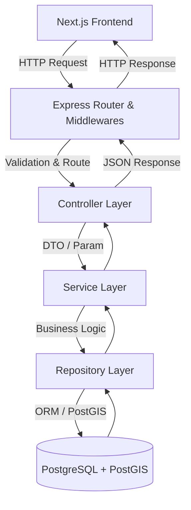
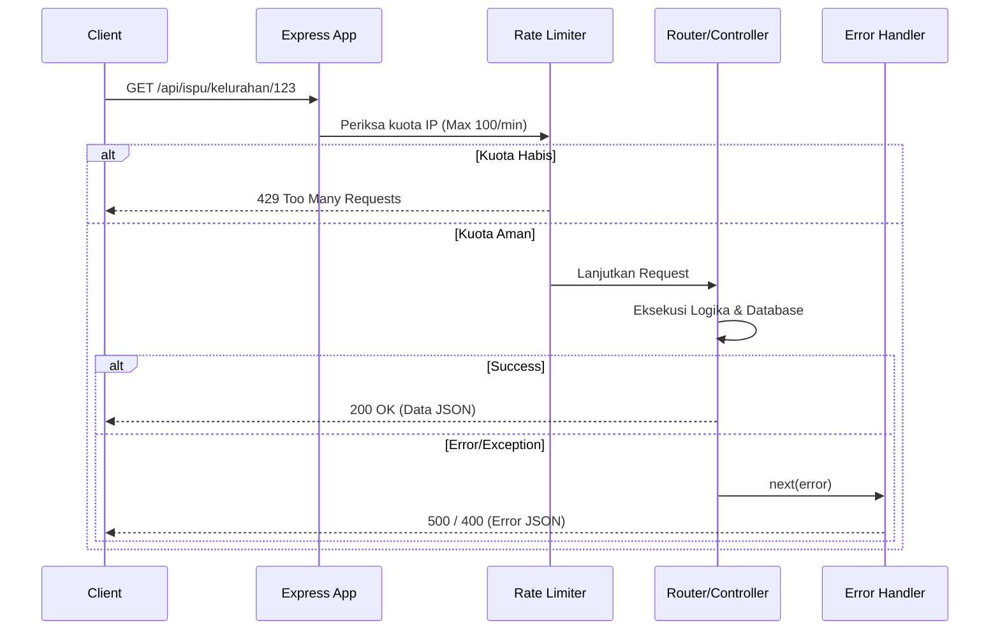

# Architecture Document
## AeroHealth Guard - Express.js Backend

Dokumen ini mendeskripsikan arsitektur *backend* utama proyek AeroHealth Guard, struktur direktori, serta pola aliran data dari HTTP Request hingga Database.

## 1. Overview Arsitektur
Proyek ini mengadopsi **Layered Architecture (Arsitektur Berlapis)** yang dikombinasikan dengan **Repository Pattern**. Pola ini secara tegas memisahkan penanganan rute/HTTP, logika bisnis (business logic), dan logika akses data, sehingga membuat kode lebih mudah diuji, di-maintain, dan direstrukturisasi.



## 2. Layer Responsibilities

### A. Controller Layer (`src/controllers/`)
Bertanggung jawab sebagai pintu masuk dan keluar data.
- **Tugas:** Menangkap HTTP Request (`req.body`, `req.query`, `req.params`), melakukan validasi dasar, memanggil fungsi di *Service Layer*, dan merangkai HTTP Response (status code & struktur JSON).
- **Aturan:** Dilarang menempatkan logika perhitungan, agregasi rumit, atau kueri basis data langsung di *controller*.

### B. Service Layer (`src/services/`)
Bertanggung jawab atas seluruh logika bisnis (Business Logic).
- **Tugas:** Menerapkan regulasi bisnis (misal: memberikan nilai *fallback* template jika nilai *Health Advisory* dari LLM kosong). Layanan ini memanggil satu atau beberapa fungsi pada *Repository Layer*.
- **Aturan:** Layanan tidak boleh tahu sama sekali tentang `req` atau `res` dari Express, agar *service* ini bisa diakses dari tempat lain (seperti CLI tools atau Cron Jobs lokal).

### C. Repository Layer (`src/repositories/`)
Bertanggung jawab penuh atas abstraksi akses database (Data Access Layer).
- **Tugas:** Mengeksekusi interaksi dengan *database* melalui modul ORM (Prisma). Pola *Repository* ini menyembunyikan kompleksitas eksekusi mentah (*raw queries*) fungsi spasial PostGIS (seperti `ST_DistanceSphere` atau `ST_Contains`) dari lapisan *Service*.

#### Contoh Kode Repository Pattern:
```javascript
// src/repositories/kelurahan.repository.js
const { PrismaClient } = require('@prisma/client');
const prisma = new PrismaClient();

class KelurahanRepository {
  /**
   * Mencari wilayah kelurahan berdasarkan titik koordinat menggunakan PostGIS
   */
  async findByLocation(lat, lng) {
    const result = await prisma.$queryRaw`
      SELECT kode_kemendagri, nama
      FROM kelurahan
      WHERE ST_Contains(geom, ST_SetSRID(ST_MakePoint(${lng}, ${lat}), 4326))
      LIMIT 1;
    `;
    return result.length > 0 ? result[0] : null;
  }
}

module.exports = new KelurahanRepository();
```

## 3. Struktur Folder Terperinci

```
backend/
├── src/
│   ├── config/              # Konfigurasi aplikasi (load .env, setup CORS origins)
│   ├── middlewares/         # Middlewares Express
│   │   ├── rate-limiter.js  # Limit 100 req/min/IP
│   │   ├── error-handler.js # Global error handler middleware
│   │   └── validator.js     # Middleware validasi request (opsional, e.g., Joi/Zod)
│   ├── controllers/         # Menangani request & response
│   │   ├── kelurahan.controller.js
│   │   ├── ispu.controller.js
│   │   ├── shelter.controller.js
│   │   └── symptom.controller.js
│   ├── services/            # Logika bisnis dan agregasi
│   │   ├── kelurahan.service.js
│   │   ├── ispu.service.js
│   │   ├── shelter.service.js
│   │   └── symptom.service.js
│   ├── repositories/        # Kueri Prisma & implementasi spasial
│   │   ├── kelurahan.repository.js
│   │   ├── ispu.repository.js
│   │   ├── hotspot.repository.js
│   │   └── shelter.repository.js
│   ├── routes/              # Definisi Endpoint API (Express Router)
│   │   ├── index.js         # Master route (menyambungkan semua route)
│   │   ├── kelurahan.routes.js
│   │   └── ...
│   ├── utils/               # Konstanta dan helper
│   │   └── constants.js     # (Contoh: template fallback KLHK, palet warna ISPU)
│   └── app.js               # Entry point, setup Express (tanpa app.listen)
├── server.js                # Server bootstrapper (memanggil app.listen)
└── prisma/
    └── schema.prisma        # Skema model Prisma ORM
```

## 4. Middleware Pipeline Diagram

Setiap permintaan (*request*) yang masuk ke aplikasi akan melalui deretan lapisan (pipeline) middleware sebagai berikut:



## 5. Database Access Patterns & PostGIS
Prisma secara *native* mendukung operasi CRUD yang sangat baik untuk tipe data skalar. Namun, untuk tipe spasial (geometri/geografi) yang dimiliki oleh ekstensi PostGIS, Prisma mengandalkan fungsi `$queryRaw`.

Oleh karena itu:
1. **Model Prisma (Skema):** Kolom bertipe spasial seperti `POINT` atau `POLYGON` dalam file `schema.prisma` akan direpresentasikan sebagai tipe khusus/raw. 
2. **Operasi Non-Spasial:** Gunakan API Prisma biasa, seperti `prisma.stasiun_ispu.findMany()` atau `prisma.kelurahan_symptom_summary.upsert()`.
3. **Operasi Spasial:** Gunakan SQL template literal bawaan Prisma `prisma.$queryRaw` untuk memanfaatkan fungsi-fungsi native PostGIS, contohnya: `ST_Contains()`, `ST_DistanceSphere()`, dan penggunaan tipe `ST_SetSRID(ST_MakePoint(lng, lat), 4326)`. Penggunaan literal string bawaan prisma mencegah SQL Injection.

## 6. Configuration Management
Semua variabel lingkungan diatur melalui package `dotenv`. File `src/config/env.js` bertindak sebagai satu-satunya *source of truth* untuk memuat dan memvalidasi `process.env`. Komponen lain di dalam aplikasi dilarang keras untuk membaca objek `process.env` secara langsung dan harus melakukan *import* dari berkas konfigurasi. Hal ini menjamin bahwa kegagalan (akibat hilangnya variabel *environment*) akan terdeteksi di awal saat *server startup*.
