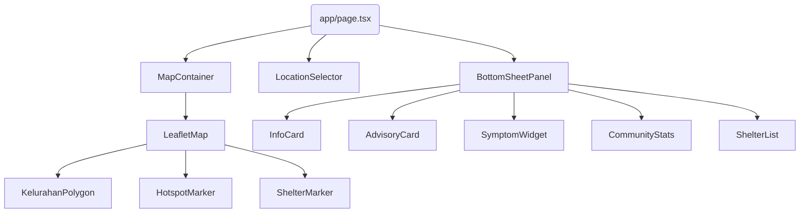

# Architecture Document - Frontend AeroHealth Guard

## 1. Overall Architecture

```mermaid
graph TD
    User([User Device]) -->|HTTP/HTTPS| NextJS[Next.js Application]

    subgraph NextJS [Next.js App Router (Frontend)]
        UI[UI Components]
        Map[Leaflet Map Component]
        Hooks[Custom Hooks/State]
        APIClient[API Client Fetch]

        UI <--> Hooks
        Map <--> Hooks
        Hooks <--> APIClient
    end

    APIClient -->|REST API| Backend[Express.js Backend]
    Map -->|Tile Requests| OSM[OpenStreetMap / Tile Server]
```

## 2. Next.js App Router Structure

Aplikasi menggunakan pola _App Router_ Next.js 14+:

- `app/layout.tsx`: Mendefinisikan struktur _HTML_ dasar, memuat _font_, dan penyedia konteks (misalnya SWR/React Query Provider).
- `app/page.tsx`: Halaman utama (_Single Page Application_ secara konseptual) yang memuat peta secara penuh.
- Komponen klien (menggunakan `'use client'`) digunakan secara intensif di direktori `components/` karena banyaknya interaktivitas (Peta, Formulir).

## 3. Data Fetching Strategy

- **SSR (Server-Side Rendering)**: Digunakan terbatas pada informasi meta awal atau data statis (jika ada).
- **CSR (Client-Side Rendering)**: Digunakan secara luas untuk memuat data peta, nilai ISPU, dan laporan gejala. Karena informasi berbasis lokasi bergantung pada browser pengguna (geolokasi), data spesifik pengguna dimuat secara _client-side_.
- Library disarankan: SWR atau React Query untuk _caching_, _revalidation_, dan manajemen _loading state_ data API.

## 4. Component Hierarchy



## 5. State Management Approach

- **Local State**: `useState` untuk input UI sederhana (misal, _dropdown_ terbuka/tertutup).
- **Global / Shared State**: React Context API untuk membagikan `selectedKelurahan`, `userLocation`, dan `mapInstance` ke seluruh komponen agar tidak terjadi _prop drilling_ yang dalam.
- Tidak menggunakan Redux karena state yang dikelola cukup spesifik pada UI dan dapat diselesaikan dengan React Context + _Data Fetching library_ (SWR/React Query).

## 6. API Client Layer Design

- Semua panggilan HTTP dibungkus dalam fungsi di `lib/api.ts`.
- Menggunakan standar `fetch` API bawaan browser atau _library_ seperti Axios.
- Desain klien menangani penambahan _base URL_ (`NEXT_PUBLIC_API_URL`), penanganan _error_ jaringan secara terpusat, dan pengembalian _Promise_.

## 7. Map Rendering Pipeline

Karena Next.js melakukan SSR, komponen `react-leaflet` akan menghasilkan _error_ jika dieksekusi di _server_ (karena `window` tidak tersedia). Oleh karena itu:

- Komponen `MapContainer` harus diimpor menggunakan `next/dynamic` dengan opsi `{ ssr: false }`.
- Layer poligon (_GeoJSON_) di-render secara iteratif setelah data koordinat didapatkan dari backend.
- Interaksi klik pada `KelurahanPolygon` akan meng-update _Global Context_ (`selectedKelurahan`), yang secara reaktif akan merender ulang komponen informasi (`InfoCard`, `AdvisoryCard`).

## 8. Performance Optimization Strategies

1. **Dynamic Import**: Memuat modul berat seperti `leaflet` dan `react-leaflet` hanya di _client-side_.
2. **GeoJSON Simplification**: Koordinat poligon kelurahan dari backend harus disederhanakan (_simplified_) agar tidak membebani memori dan proses _rendering_ browser pada _mobile device_.
3. **Lazy Loading Components**: Komponen modal atau daftar panjang (seperti `ShelterList`) dimuat secara _lazy_.
4. **Caching Data API**: Penggunaan SWR/React Query akan melakukan _cache_ pada data _hotspot_ dan ISPU selama beberapa menit agar saat _panning_ peta, aplikasi tidak terus-menerus memanggil API.
